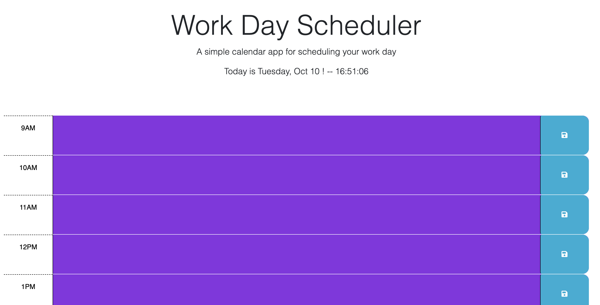

# schedule-calendar

## project description

This project uses a daily planner to create a schedule for the user. The problem it solves is to add events and appointments to a daily planner so that the user may manage their day. The time is blocked off in color indicating past, present, and future time compared to the current time of day. The current day of the week and date is displayed at the top of the page.

Things that were utilized during this project include javascript, dayjs, and css. 

Things for the future could include adding checkboxes to the items in the calendar as a to do list for the user. 
## usage
Webpage screenshot:

Webpage link:https://lavollmer.github.io/schedule-calendar/
## credits

Credits include tutoring services and the U of MN bootcamp 2023 class. Starter code was obtained from the U of MN class project work.
## license
 MIT license
